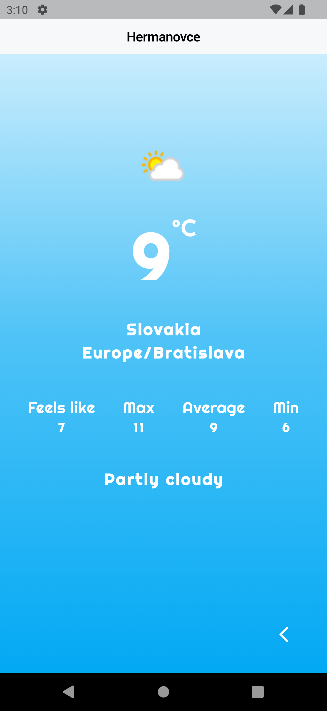

# WeatherApp

[](https://flutter.dev/)

## Overview

WeatherApp is a Flutter application that provides weather information for cities. The app consists of two screens:

1. **Search Screen**: Features an animated search bar where users can enter the name of a city to search for its weather.
2. **Weather Details Screen**: Displays the weather information for the selected city.

The app fetches weather data from an API using Dio and employs Cubit for state management.

## Features

- **Search Screen**:

  - Animated search bar for entering city names.
  - User-friendly interface for initiating a search.

- **Weather Details Screen**:
  - Displays detailed weather information for the selected city.
  - Shows temperature, weather conditions, and other relevant data.

## Dependencies

- `cupertino_icons`: ^1.0.2
- `anim_search_bar`: ^2.0.3
- `dio`: ^5.4.1
- `flutter_bloc`: ^8.1.4
- `meta`: ^1.10.0

## State Management

The app uses [Cubit](https://pub.dev/packages/cubit) for state management, allowing for efficient and predictable state transitions.

## API Integration

Weather data is fetched from an API using [Dio](https://pub.dev/packages/dio), a powerful HTTP client for Dart.

## Screenshots

<div style="display: flex; flex-wrap: wrap;">
    <div style="margin: 10px;">
        <p>Search Screen</p>
        
        
        
    </div>
    <div style="margin: 10px;">
       <p>Details Screen</p>
        
        
        
        
        
    </div>
</div>

## Getting Started

To get a local copy of the project up and running, follow these steps:

1. **Clone the repository**

   ```bash
   git clone https://github.com/marcolous/Flutter-WeatherApp.git
   ```
2. Navigate to the project directory:
   ```bash
   cd OtakuNest
   ```
3. Install the dependencies:
   ```bash
   flutter pub get
   ```
4. Run the app:
   ```bash
   flutter run
   ```

## Usage

### Search Screen

- Use the animated search bar to enter the name of a city.
- Press enter or tap the search button to initiate the search.

### Weather Details Screen

- View the weather details for the city you searched for.
- Information includes temperature, weather conditions, and other relevant data.

## Contributing

If you have suggestions for improvements or bug fixes, please open an issue or submit a pull request.

## License

This project is licensed under the MIT License - see the [LICENSE](LICENSE) file for details.

## Contact

If you have any questions or feedback, feel free to reach out to me at [louismarco226@gmail.com](mailto:louismarco226@gmail.com).
